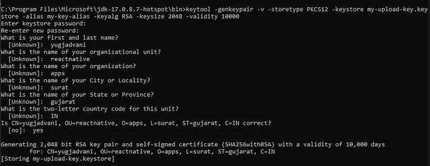

So, you’ve spent countless hours developing your React Native application, and now it’s time to share it with the world. One of the most exciting moments in an app developer’s journey is seeing their creation live on platforms like the Google Play Store, accessible to millions of users worldwide. However, before you can achieve this milestone, there are several crucial steps you need to follow. In this guide, we’ll walk you through the process of building an APK file from your React Native application and publishing it on the Google Play Store.

## Table of contents

## Step 1: Generating an Upload Key

The first step in preparing your app for release is generating an upload key. This key is essential for signing your APK file, ensuring its authenticity and integrity. To generate the upload key:

1. Open your command line interface.
2. Navigate to your JDK directory (e.g., `C:\Program Files\Microsoft\jdk-17.0.8.7-hotspot\bin>`).
3. Run the following command as an administrator:

```bash
keytool -genkeypair -v -storetype PKCS12 -keystore my-upload-key.keystore -alias my-key-alias -keyalg RSA -keysize 2048 -validity 10000
```

4. Follow the prompts to provide the necessary information.



5. Once completed, locate the `my-upload-key.keystore` file generated in your JDK directory.

---

## Step 2: Setting up Gradle Variables

After generating the upload key, you need to set up Gradle variables to use it during the build process. Follow these steps:

1. Place the `my-upload-key.keystore` file under the `android/app` directory in your React Native project folder.
2. Edit the `~/.gradle/gradle.properties` or `android/gradle.properties` file, and add the following lines (replace `*****` with the correct keystore password, alias, and key password):

```bash
MYAPP_UPLOAD_STORE_FILE=my-upload-key.keystore
MYAPP_UPLOAD_KEY_ALIAS=my-key-alias
MYAPP_UPLOAD_STORE_PASSWORD=*****
MYAPP_UPLOAD_KEY_PASSWORD=*****
```

---

## Step 3: Adding Signing Config to Your App’s Gradle Config

Next, you need to configure your app’s Gradle build script to use the upload key for signing release builds. Follow these instructions:

1. Open the `android/app/build.gradle` file in your project folder.
2. Add the signing config as follows:

```diff
android {
    ...
    signingConfigs {
        release {
            if (project.hasProperty('MYAPP_UPLOAD_STORE_FILE')) {
                storeFile file(MYAPP_UPLOAD_STORE_FILE)
                storePassword MYAPP_UPLOAD_STORE_PASSWORD
                keyAlias MYAPP_UPLOAD_KEY_ALIAS
                keyPassword MYAPP_UPLOAD_KEY_PASSWORD
            }
        }
    }
    buildTypes {
        release {
            ...
            signingConfig signingConfigs.release
            // signingConfig signingConfigs.debug
        }
    }
}
```

---

## Step 4: Building the APK File

Now that everything is set up, it’s time to build your APK file. Follow these simple steps:


1. Navigate to the `android` directory of your React Native project.
2. Run the following command to clean the project:

```bash
./gradlew clean
```

3. Finally, generate the APK file by executing the following command:

```bash
./gradlew assembleRelease
```

---

## Step 5: Testing and Distribution

Once the build process is complete, you’ll find your APK file located at `android/app/build/outputs/apk/release/app-release.apk`. You can now install this APK on any Android device for testing purposes. Ensure that everything functions as expected before proceeding further.

---

## Step 6: Publishing on the Google Play Store

With your thoroughly tested APK file ready, it’s time to publish your app on the Google Play Store. This process involves creating a developer account, preparing your store listing, uploading assets, setting pricing and distribution, and finally, publishing your app to the world.

Congratulations! You’ve successfully built and published your React Native app on the Google Play Store. Now sit back, relax, and watch your creation reach and delight users across the globe. Happy coding!

---

To all our dear readers,

As we come to the end of this guide, we want to take a moment to express our heartfelt gratitude to each and every one of you. Thank you for accompanying us on this journey through the intricate process of building and publishing a React Native app on the Google Play Store.

Your curiosity, enthusiasm, and dedication to mastering new skills inspire us every day. We hope that this guide has been a source of valuable insights and practical knowledge, empowering you to bring your creative visions to life and share them with the world.

Remember, every line of code you write, every challenge you overcome, and every app you build is a testament to your passion for innovation and your commitment to excellence. Keep dreaming big, keep pushing boundaries, and never lose sight of the incredible impact your work can have.

As you embark on your next adventure in app development, know that we’re cheering you on every step of the way. May your journey be filled with joy, discovery, and boundless opportunities for growth.

With deepest gratitude and warmest wishes,

Yug Jadvani.

---

> Enjoyed the read? If you found this article insightful or helpful, consider supporting my work by buying me a coffee. Your contribution helps fuel more content like this. [Click here](https://buymeacoffee.com/yugjadvani9) to treat me to a virtual coffee. Cheers!