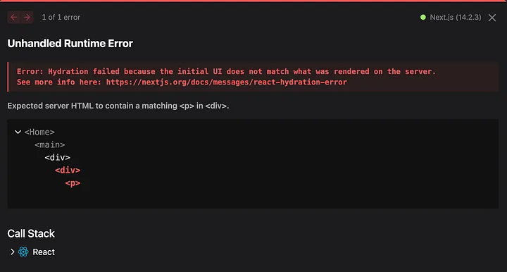
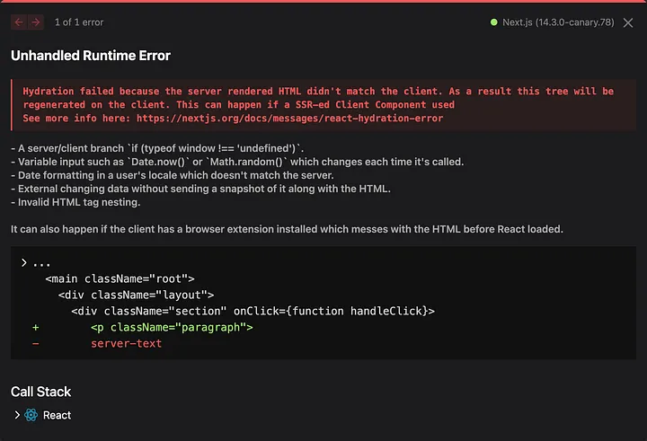
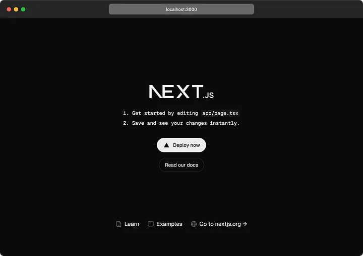

The highly anticipated [Next.js 15](https://nextjs.org/docs/app/building-your-application/upgrading/version-15) Release Candidate (RC) is now available, offering developers a chance to test out the latest features before the stable release. This RC comes packed with new experimental tools, significant improvements, and breaking changes that promise to enhance the development experience. Here’s an in-depth look at what’s new in [Next.js 15 RC](https://nextjs.org/docs).

## Key Highlights of Next.js 15 RC

1. **React 19 RC Support:** [Next.js 15 RC](https://nextjs.org/docs) supports [React 19](https://react.dev/learn/react-compiler) RC, enabling developers to leverage new client and server features, such as Actions. Built on the React canary channel, this update allows early feedback on new React APIs. However, some third-party libraries may still need compatibility updates for [React 19](https://react.dev/blog/2024/04/25/react-19-upgrade-guide).

2. **React Compiler (Experimental):** The React Compiler is an experimental tool developed by Meta’s React team. It deeply understands JavaScript semantics and React rules, allowing it to optimize code automatically. This reduces the need for manual memoization, simplifying maintenance and minimizing errors. [Next.js 15 RC](https://nextjs.org/docs) integrates support for this compiler through a Babel plugin.

**To get started:**

```bash
npm install babel-plugin-react-compiler
```

Add the following to `next.config.js`:

```javascript
const nextConfig = {
  experimental: {
    reactCompiler: true,
  },
};
module.exports = nextConfig;
```

For opt-in mode:

```javascript
const nextConfig = {
  experimental: {
    reactCompiler: {
      compilationMode: 'annotation',
    },
  },
};
module.exports = nextConfig;
```

---

## 3. Improved Hydration Error Handling

Next.js 15 continues to enhance error messages and hydration errors introduced in version 14.1. The improved error view now includes the source code and suggestions for resolving issues, providing developers with clearer and more actionable feedback.

For example, this was a previous hydration error message in Next.js 14.1:



Next.js 15 RC has improved this to:



## 4. Updated Caching Defaults

Responding to user feedback, Next.js 15 changes the default caching behavior. Fetch requests, GET Route Handlers, and Client Router Cache are now uncached by default. This change aims to optimize performance and accommodate projects using Partial Prerendering (PPR) and third-party libraries.

- To cache fetch requests, set `cache: 'force-cache':`

```bash
fetch('https://...', { cache: 'force-cache' | 'no-store' });
```

- For route handlers, use `export dynamic = 'force-static'`.

## 5. Partial Prerendering (Experimental)

Partial Prerendering (PPR) combines static and dynamic rendering on the same page. This feature, introduced in Next.js 14, now allows incremental adoption. Developers can enable PPR for specific layouts and pages, enhancing flexibility and performance.

Example configuration:

```javascript
export const experimental_ppr = true;

export default function Page() {
  return (
    <>
      <StaticComponent />
      <Suspense fallback={...}>
        <DynamicComponent />
      </Suspense>
    </>
  );
}
```

Enable incremental PPR in `next.config.js`:

```javascript
const nextConfig = {
  experimental: {
    ppr: 'incremental',
  },
};
module.exports = nextConfig;
```

## 6. New next/after API (Experimental)

The `next/after` API allows developers to execute code after a response has finished streaming. This is useful for tasks like logging and analytics that should not block the primary response.

Enable in `next.config.js`:

```javascript
const nextConfig = {
  experimental: {
    after: true,
  },
};
module.exports = nextConfig;
```

Example usage:

```javascript
import { unstable_after as after } from 'next/server';
import { log } from '@/app/utils';

export default function Layout({ children }) {
  after(() => {
    log();
  });

  return <>{children}</>;
}
```

## 7. create-next-app Enhancements

The create-next-app tool has received a design update and new flags to improve the developer experience. The `--turbo` flag enables Turbopack in local development and the `--empty` flag creates a minimal "hello world" project.

For Next.js 15, we’ve updated `create-next-app` with a new design.



When running `create-next-app`, there is a new prompt asking if you want to enable Turbopack for local development (defaults to `No`).

```bash
✔ Would you like to use Turbopack for next dev? … No / Yes
```

**Example commands:**

The `--turbo` flag can be used to enable Turbopack.

```bash
npx create-next-app@rc --turbo
```

To make getting started on a new project even easier, a new `--empty` flag has been added to the CLI. This will remove any extraneous files and styles, resulting in a minimal "hello world" page.

```bash
npx create-next-app@rc --empty
```

## 8. Bundling External Packages

Next.js 15 introduces new configuration options for bundling external packages, improving cold start performance. The [bundlePagesRouterDependencies](https://nextjs.org/docs/pages/api-reference/next-config-js/bundlePagesRouterDependencies) option unifies the configuration for the App and Pages Router.

Configuration in `next.config.js`:

```javascript
const nextConfig = {
  // Automatically bundle external packages in the Pages Router:
  bundlePagesRouterDependencies: true,
  // Opt specific packages out of bundling for both App and Pages Router:
  serverExternalPackages: ['package-name'],
};

module.exports = nextConfig;
```

## Breaking Changes and Improvements

- The minimum React version is now 19 RC.
- `next/image` updates: removed squoosh in favor of sharp, changed default Content-Disposition to attachment, and error handling for src with spaces.
- Middleware updates to limit unrecommended React API imports.
- `next/font`: Removed support for external package and font-family hashing.
- Various caching, configuration, and performance improvements.

## Try Next.js 15 RC Today

To start exploring these features, install Next.js 15 RC along with React 19 RC:

```bash
npm install next@rc react@rc react-dom@rc
```

You can view the Next.js 15 RC documentation at [https://rc.nextjs.org/docs](https://nextjs.org/docs) until the stable release.

## Conclusion

Next.js 15 RC is a significant step forward, offering powerful new tools and enhancements that streamline development and improve performance. By testing these features now, developers can provide valuable feedback and prepare their projects for the stable release. Dive into Next.js 15 RC today and experience the future of web development!

---

> Enjoyed the read? If you found this article insightful or helpful, consider supporting my work by buying me a coffee. Your contribution helps fuel more content like this. [Click here](https://buymeacoffee.com/yugjadvani9) to treat me to a virtual coffee. Cheers!