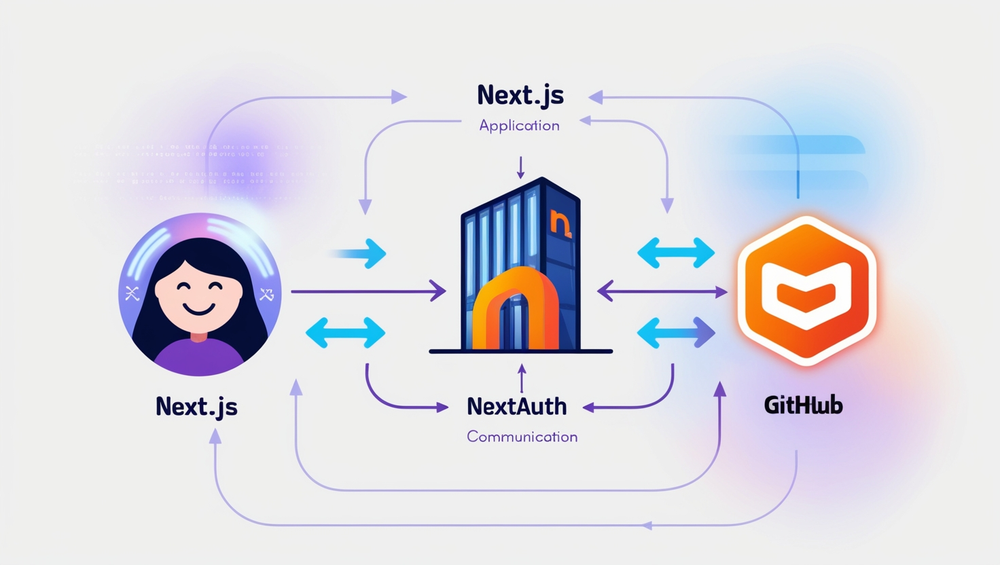

## Table of contents

## Introduction

Next.js has become a preferred framework for modern web applications due to its simplicity and flexibility. One key aspect of any application is user authentication, and integrating GitHub login into a Next.js project is a practical choice. In this guide, we’ll walk through setting up a Next.js project with GitHub authentication using `Auth.js`, breaking it down into clear, actionable steps.

Whether you’re a beginner or an experienced developer, this guide will help you configure authentication seamlessly.

---

## Step 1: Setting Up Your Next.js Project

First, we need to create a new Next.js project. Follow these steps:

1. Open your terminal and run the following command:

```bash
npx create-next-app@latest
```

2. You will be prompted to configure your project. Here’s an example of how to answer these questions:

- **What is your project named?** `my-app`
- **Would you like to use TypeScript?** `Yes` or `No` (your choice)
- **Would you like to use ESLint?** `Yes` or `No`
- **Would you like to use Tailwind CSS?** `Yes` or `No`
- **Would you like your code inside a** `src/` **directory?** `Yes` or `No`
- **Would you like to use App Router?** `Yes` (recommended)
- **Would you like to use Turbopack for** `next dev`? `No` or `Yes` (your preference)
- **Customize the import alias?** You can set it to `@/*` or leave it as default.

3. Once complete, navigate to your project directory:

```bash
cd my-app
```

---

## Step 2: Install Auth.js

To manage authentication, we’ll use Auth.js (formerly known as NextAuth.js). Install it with the following command:

```bash
npm install next-auth@beta
```

---

## Step 3: Configure Auth.js



1. **Generate an Authentication Secret**
   Run the following command to create an `AUTH_SECRET`, which will be used to secure tokens:

```bash
npx auth secret
```

This will also automatically add it to your `.env.local` file.

2. **Create an `auth.ts` File**
   In your project root, create a file called `auth.ts` and set it up as follows:

```typescript
import NextAuth from "next-auth";
import GitHub from "next-auth/providers/github";

export const { handlers, signIn, signOut, auth } = NextAuth({
  providers: [GitHub], // Adding GitHub as the provider
});
```

3. **Add Route Handlers**
   Next, create a new file under the `app` directory:
   `./app/api/auth/[...nextauth]/route.ts`

```typescript
import { handlers } from "@/auth";
export const { GET, POST } = handlers;
```

4. **Optional: Middleware for Session Management**
   To keep the session alive, add a `middleware.ts` file:

```typescript
export { auth as middleware } from "@/auth";
```

---

## Step 4: Configure GitHub OAuth

1. **Create a GitHub OAuth App**

- Log in to GitHub and navigate to **Settings > Developer settings > OAuth apps.**
- Click **New OAuth App** and provide the following:
  1. **Application Name**: Choose a meaningful name.
  2. **Homepage URL**: The full URL of your app (e.g., `https://example-domain.com`).
  3. **Authorization Callback URL**: This should be:
     `https://example-domain.com/api/auth/callback/github`
     Save the app and copy the **Client ID** and **Client Secret**.

2. **Add Environment Variables**
   In your **.env.local** file, add the following:

```bash
AUTH_GITHUB_ID="<Your Client ID>"
AUTH_GITHUB_SECRET="<Your Client Secret>"
```

---

## Step 5: Create a Navbar Component

To make the authentication experience user-friendly, let’s build a `Navbar` component for login and logout functionality. Below is a complete example:

```typescript
import Link from "next/link";
import Image from "next/image";
import { BadgePlus, LogOut } from "lucide-react";
import { Avatar, AvatarFallback, AvatarImage } from "@/components/ui/avatar";
import { auth, signIn, signOut } from "../../auth";

const Navbar = async () => {
    const session = await auth();

    return (
        <header className="px-5 py-3 bg-white shadow-sm font-work-sans">
            <nav className="flex justify-between items-center">
                <Link href="/">
                    <Image src="/logo.png" alt="logo" width={144} height={30} />
                </Link>

                <div className="flex items-center gap-5 text-black">
                    {session && session?.user ? (
                        <>
                            <Link href="/startup/create">
                                <span className="max-sm:hidden">Create</span>
                                <BadgePlus className="size-6 sm:hidden" />
                            </Link>
                            <form action={async () => {
                                "use server";
                                await signOut({ "redirectTo": "/" });
                            }}>
                                <button type={'submit'}>
                                    <span className="max-sm:hidden">Logout</span>
                                    <LogOut className="size-6 sm:hidden text-red-500" />
                                </button>
                            </form>

                            <Link href={`/user/${session?.id}`}>
                                <Avatar className="size-10">
                                    <AvatarImage
                                        src={session?.user?.image || ""}
                                        alt={session?.user?.name || ""}
                                    />
                                    <AvatarFallback>AV</AvatarFallback>
                                </Avatar>
                            </Link>
                        </>
                    ) : (
                        <form action={async () => {
                            "use server";
                            await signIn("github");
                        }}>
                            <button type={"submit"}>Login</button>
                        </form>
                    )}
                </div>
            </nav>
        </header>
    );
};

export default Navbar;
```

---

## Conclusion

You’ve successfully set up a Next.js project with GitHub login! This step-by-step guide equips you with the basics of using Auth.js for authentication. Whether you’re building a personal project or a professional application, this method ensures secure and seamless GitHub integration.

Happy coding!

---

> Enjoyed the read? If you found this article insightful or helpful, consider supporting my work by buying me a coffee. Your contribution helps fuel more content like this. [Click here](https://buymeacoffee.com/yugjadvani9) to treat me to a virtual coffee. Cheers!
