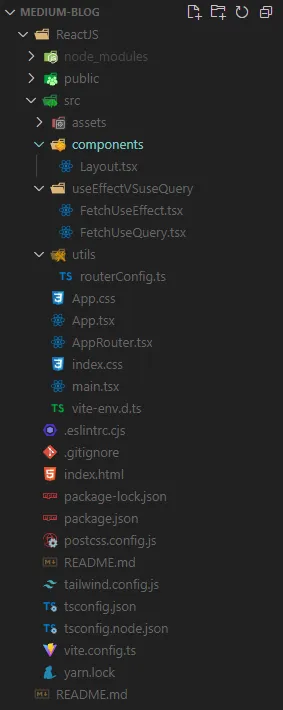

## Table of contents

## Command for creating a Vite app:

- **Using npm:** `npm create vite@latest`
- **Using yarn:** `yarn create vite`

First, you’ll be asked for project name:

```bash
yarn create vite
? Project name: › vite-project
```

Then it asks for a framework to choose:

```bash
yarn create vite
✔ Project name: … vite-project
? Select a framework: › - Use arrow-keys. Return to submit.
    Vanilla
    Vue
❯   React
    Preact
    Lit
    Svelte
    Solid
    Qwik
    Others
```

Select React and hit Enter.

Then you need to choose whether to use JavaScript/TypeSprit with Babel/SWC:

```bash
yarn create vite
✔ Project name: … vite-project
✔ Select a framework: › React
? Select a variant: › - Use arrow-keys. Return to submit.
    TypeScript
❯   TypeScript + SWC
    JavaScript
    JavaScript + SWC
```

This command will create a new Vite app using the latest version of Vite.

It’s a final step, and then you should see something like this:

```bash
yarn create vite
✔ Project name: … vite-project
✔ Select a framework: › React
✔ Select a variant: › TypeScript + SWC
```

```
Scaffolding project in /Users/YugJadvani/vite-project...
Done. Now run:
  cd vite-project
  yarn
  yarn dev
```

Now go to the project folder, install dependencies, start dev server to check that everything works fine.

## Introduction to Vite.js:

Vite.js is a next-generation frontend build tool that redefines the modern development experience. Built on the principles of speed, simplicity, and developer happiness, Vite (French for “fast”) revolutionizes the way developers build web applications. Unlike traditional bundlers, Vite leverages native ES Module imports to deliver lightning-fast startup times and instantaneous hot module replacement (HMR).

With out-of-the-box support for modern frameworks like Vue.js, React, and Svelte, Vite empowers developers to embrace the latest web technologies without sacrificing performance. Whether you’re a seasoned developer or just getting started, Vite.js promises to streamline your workflow and unlock new possibilities in web development.

Say hello to Vite.js and goodbye to sluggish builds — welcome to the future of frontend development.

---

## Introduction:

Have you ever found yourself lost in a labyrinth of relative paths, typing in endless `../../` only to realize you’re still not where you need to be? Say goodbye to that frustration! With the power of Vite.js, coupled with ReactJS and TypeScript, you can bid farewell to those cumbersome relative paths forever. In this guide, we’ll explore how to effortlessly resolve alias file paths, making your development experience smoother and more enjoyable.



**Step 1:**

Configuring TypeScript for Aliases The first step towards liberation from relative paths is to update your `tsconfig.json` file. By adding a baseUrl and defining paths for your aliases, TypeScript will seamlessly resolve imports to the correct file locations. No more hunting through directories!

The current version of Vite splits TypeScript configuration into three files, two of which need to be edited. Add the `baseUrl` and `paths` properties to the `compilerOptions` section of the `tsconfig.json` and `tsconfig.app.json` files:

```json
// tsconfig.json
{
  "compilerOptions": {
    "baseUrl": ".",
    "paths": {
      "@/*": ["./src/*"]
    }
  }
}
```

**Step 2:**

Add the following code to the `tsconfig.app.json` file to resolve paths, for your IDE:

```json
{
  "compilerOptions": {
    // ...
    "baseUrl": ".",
    "paths": {
      "@/*": ["./src/*"]
    }
    // ...
  }
}
```

**Step 3:**

Configuring Vite.js for Aliases Now, let’s leverage the power of Vite.js to handle these aliases during bundling. By modifying the vite.config.ts file and using the resolve.alias option, we can map our aliases to their respective paths, ensuring seamless imports throughout our project.

## Command for install node:path:

```bash
# (so you can import "path" without error)
npm i -D @types/node
```

```typescript
// vite.config.ts
import path from "path";
import react from "@vitejs/plugin-react";
import { defineConfig } from "vite";

export default defineConfig({
  plugins: [react()],
  resolve: {
    alias: {
      "@": path.resolve(__dirname, "./src"),
    },
  },
});
```

## Conclusion:

Congratulations! You’ve now unlocked the secret to eliminating those pesky relative paths from your development workflow. With the combination of Vite.js, ReactJS, and TypeScript, navigating through your project’s files has never been easier. Say goodbye to the days of endless ../../../ and hello to a world where imports are clean, concise, and effortlessly resolved. Happy coding!

## Code Sample:

```typescript
// AppRouter.tsx
import Layout from "@/components/Layout";
import FetchUseEffect from "@/useEffectVSuseQuery/FetchUseEffect";
import FetchUseQuery from "@/useEffectVSuseQuery/FetchUseQuery";
```

Now, armed with this newfound knowledge, you’re ready to take your development journey to new heights. Say hello to productivity and bid farewell to relative path woes.

---

> Enjoyed the read? If you found this article insightful or helpful, consider supporting my work by buying me a coffee. Your contribution helps fuel more content like this. [Click here](https://buymeacoffee.com/yugjadvani9) to treat me to a virtual coffee. Cheers!
