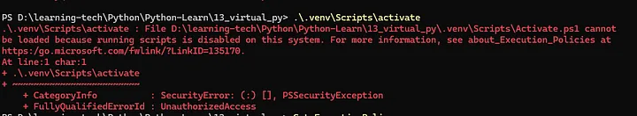

## Table of contents

## Introduction

Managing dependencies in Python projects can be challenging, especially when working on multiple projects with different requirements. Virtual environments provide a solution by creating isolated environments for each project. this guide will walk you through the essentials of creating and managing Python virtual environments using `venv` and `virtualenv`.

## Installing Virtual Environment Tools

To get started with virtual environments, you’ll need to install the `virtualenv` package:

```bash
pip install virtualenv
```

You can find more information and guidance on the following resources:

- [virtualenv on PyPI](https://pypi.org/project/virtualenv/)
- [Virtualenv GitHub Repository](https://github.com/pypa/virtualenv)
- [Virtualenv User Guide](https://virtualenv.pypa.io/en/latest/user_guide.html)
- [Python venv Documentation](https://docs.python.org/3/library/venv.html)
- [PowerShell Execution Policies](https://learn.microsoft.com/en-us/powershell/module/microsoft.powershell.core/about/about_execution_policies?view=powershell-7.4)

## Creating a New Virtual Environment

Creating a virtual environment is straightforward. Use the following command, replacing `env_name` with your preferred environment name:

```bash
python -m venv env_name
```

## Activating and Deactivating Virtual EnvironmentsOn Linux or Mac

To activate your virtual environment, use:

```bash
source env_name/bin/activate
```

To deactivate it, simply run:

```bash
deactivate
```

## On Windows

To activate the environment, use:

```bash
.\env_name\Scripts\activate
```

In case you encounter an error with the activation command, adjust the execution policy in PowerShell:



```bash
Get-ExecutionPolicy
Set-ExecutionPolicy -Scope CurrentUser -ExecutionPolicy Unrestricted -Force
Set-ExecutionPolicy -Scope CurrentUser -ExecutionPolicy Bypass -Force
```

## Installing Packages

Once your virtual environment is set up, you can install packages using `pip`:

```bash
pip install package_name
```

## Saving Installed Packages to a File

To keep track of the packages you’ve installed, you can save the list to a `requirements.txt` file:

```bash
pip freeze > requirements.txt
```

OR

```bash
pip list --format=freeze > requirements.txt
```

## Installing Packages from a File

To install the packages listed in your `requirements.txt` file, use:

```bash
pip install -r requirements.txt
```

## Conclusion

Virtual environments are an essential tool for Python developers, providing a clean and isolated workspace for each project. By following this guide, you can easily create, manage, and utilize virtual environments to streamline your development process. Happy coding!

---

> Enjoyed the read? If you found this article insightful or helpful, consider supporting my work by buying me a coffee. Your contribution helps fuel more content like this. [Click here](https://buymeacoffee.com/yugjadvani9) to treat me to a virtual coffee. Cheers!
